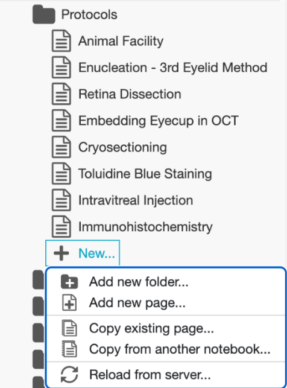

# {{page.title}}

Here we document the procedure to perform certain techniques in the wet lab.

## LabArchives

This will be either your lab notebook or a digital facsimile of your lab notebook. It will be used to track your work.

The purpose of this documentation is for:

* Troubleshooting: Knowing what you did on each step will give you a checklist of targets to tweak.
* Reproducibility: If your work needs to be double-checked or additional samples are needed, the details here ensure that the procedure is consistent.
* Followup: If a project is placed on the backburner, your notebook should be able to get you up to speed on the project's last known status.

After you sign up for lab archive, search your Emails in the following weeks for an Email from Lab Archives. It will have the senders address of info@e.labarchives.com and possibly assigned to an Amy Sutton. These are marketing emails and provide no opt-out through the website. The Email, however, will have a legally required unsubscribe button in the form of a text hyperlink labelled 'Click here to unsubscribe' in the Email footer. From there, unsubscribe from all of their Marketing Emails.

### General Usage

 

Each page can have multiple sections:

Make sure to click “save to page” before exiting document.

### ORGANIZATION

Some folders may already be present (e.g. protocols, experimental data, lab meeting notes, etc.).
Add folders as needed to keep lab notebook organized.

### PROTOCOLS

Write down all materials beforehand.
Write detailed steps for each procedure and update as necessary.
All changes are kept in a history, but for consistency with physical notebooks you should strikethrough incorrect information rather than deleting it.

Example:

### DAILY REPORTS 

Keep a record of EVERYTHING you do in the lab.
Each entry should include the goal, personnel, samples, and methods.
Make sure to include results and any analyses to get those results.

Example:

## Reiterate some of the introduction materials with more details and at a higher resolution

Attire, How to handle equipment, etc

## How to prepare a library for sequencing

Receive quote from Novogene, and request a purchase order from Joy (joy.hernandez@pennmedicine.upenn.edu).
Send the purchase order to Reighard Pullins from Novogene (Reighard.Pullins@novogeneusa.com).

### Accessing Novogene Customer Service System

Log into https://cssamerica.novogene.com/ using the following login information:

Novogene username: Yuyan.Cheng@pennmedicine.upenn.edu
Password: SLCChenglab310B

On the left side, click on Send Samples. Upload the sample information to the according project.
Once the form is approved, you’ll receive a confirmation email with the packing slip document.
To ship samples out on Tuesday's, schedule through the link https://forms.office.com/r/5mA7fMVHYd and fill in the form by Monday's 5pm EST.

### Preparing Samples for Shipment

Print out two copies of the packing slip/CSS Sample Information Form (SIF).
Fill a styrofoam box with dry ice and prepare a 50 mL tube by folding one copy of the packing slip into the tube.
Take out the library sample from the -20 C fridge. Ensure the sample tube is labeled on the top and side with the exact batch name on the product order.
Place the sample tube in the 50 mL tube with the folded packing slip.
Wrap Parafilm around the cap to seal the tube, and place inside the styrofoam box.
Tape the lid to the styrofoam box. Tape the second copy of the packing slip/CSS Sample Information Form to the top of the lid.

The pick-up team will arrive within the given time frame to receive the package.

